# Oracle Autonomous Database Provisioning

## Introduction

In this lab we provision an **Autonomous Database** using the **Microsoft Azure Portal** that we will use to run the rest of the workshop. 

**Autonomous Database on shared Exadata infrastructure**: Autonomous Database provides an easy-to-use, fully autonomous database that scales elastically, delivers fast query performance, and requires no database administration.

We can provision other 2 flavours of database in Azure:
- **Oracle Exadata Database**: You can provision flexible Exadata systems that allow you to add database compute servers and storage servers to your system at any time after provisioning.

- **Base Database**: Using ODSA, you can deploy Oracle Enterprise Edition or Oracle Standard Edition 2 databases on virtual machine DB systems. You can deploy single-node systems or 2-node RAC systems.

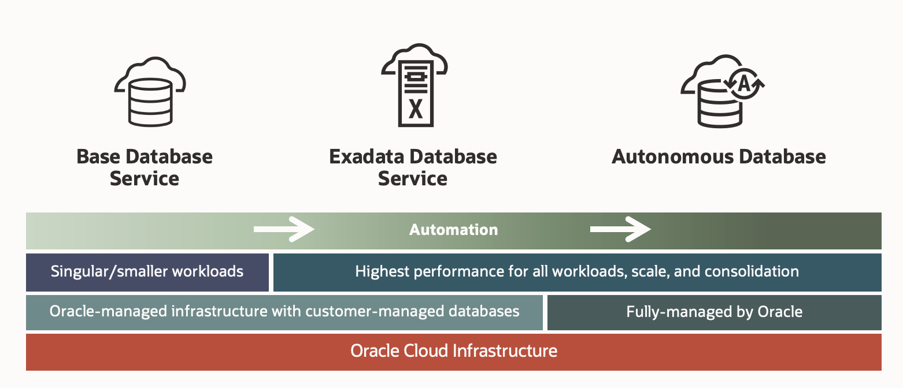

The three workloads that you can choose are:

- Build with the best of OCI and Azure services 
- Use fully managed Oracle Databases with Azure
- Run exclusive OCI database services with Azure

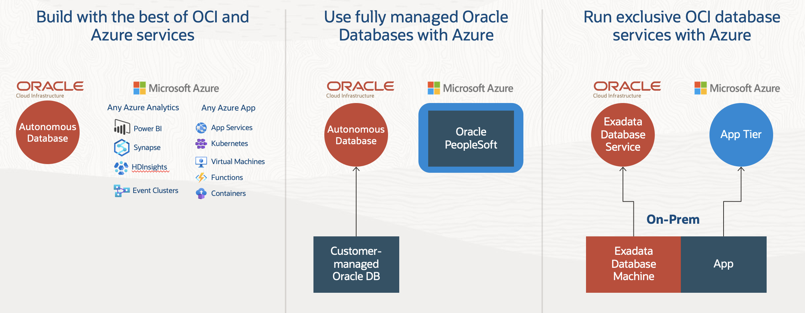

For this workshop we are going to use **Autonomous Database** as one of the three options. 

**Estimated Lab Time: 15 minutes.**

### Objectives

In this lab, you will:

* Provision Oracle Autonomous Database

### Prerequisites

* Have previous labs completed.

## Task 1: Provision Autonomoud Database (ADB)

1. Login to Azure ODSA Portal: [signup.multicloud.oracle.com/azure](https://signup.multicloud.oracle.com/azure)

    

2. We can see on the ODSA Dashboard the three database versions that we can provision. Click on Autonomous Database

    

3. Click on **+ Create** bottom.

    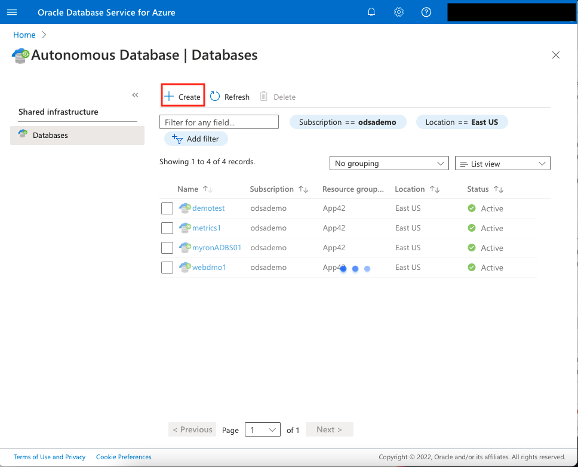

4. Let starting filling the required information, in this case, **Basics**, after click **Next: Configuration**.
    
    - **Project Details**
        - Subscription: **Azure Tenant Name**
        - Resource group: Compartment where you want to provision the Database.
    - **Instance details**    
        - Name: Name of the database 
        - Region: Region where your database will be allocate. In our case: **Germany West Central**. You have to select any of the 11 regions where ODSA is available at the moment.

        **Which Azure regions does Oracle Database Service for Azure support?**
        Oracle Database Service for Azure currently supports the following Azure regions and corresponding OCI regions:
        - Brazil South
        - Canada Central
        - East US
        - Germany West Central
        - Japan East
        - Korea Central
        - Southeast Asia
        - UK South
        - West Europe
        - West US
        - West US 3
        
        The corresponding OCI regions are: Vinhedo, Toronto, Ashburn, Frankfurt, Tokyo, Seoul, Singapore, London, Amsterdam, Phoenix, and San Jose.

        To learn more about the ODSA regions check the [FAQ Topics for ODSA document](https://www.oracle.com/ie/cloud/azure/oracle-database-for-azure/faq/).

    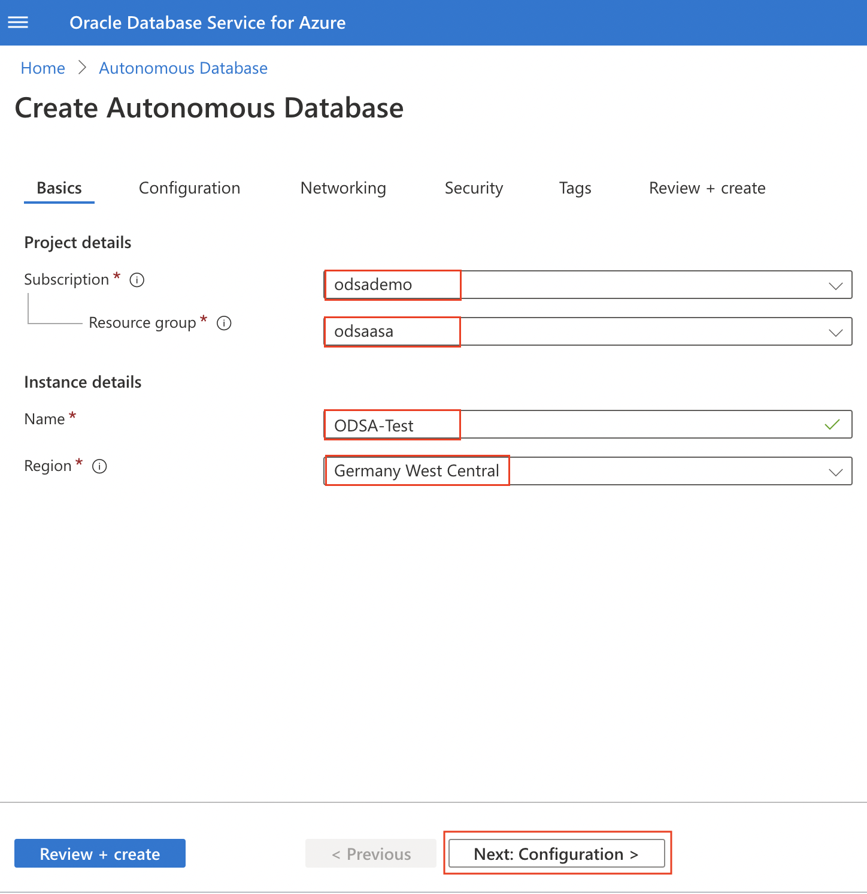

5. We will provide, the **Configuration** information, after click **Next: Networking**.
    
    - **Workload type**: Data Warehouse
    - **OCPU count**: 1
    - **OCPU auto scaling**: On
    - **Storage (TB)**: 1
    - **License type**: License included
    - **Database details**
        - **Database version**: 19c
        - **Database name**: ODSATest

    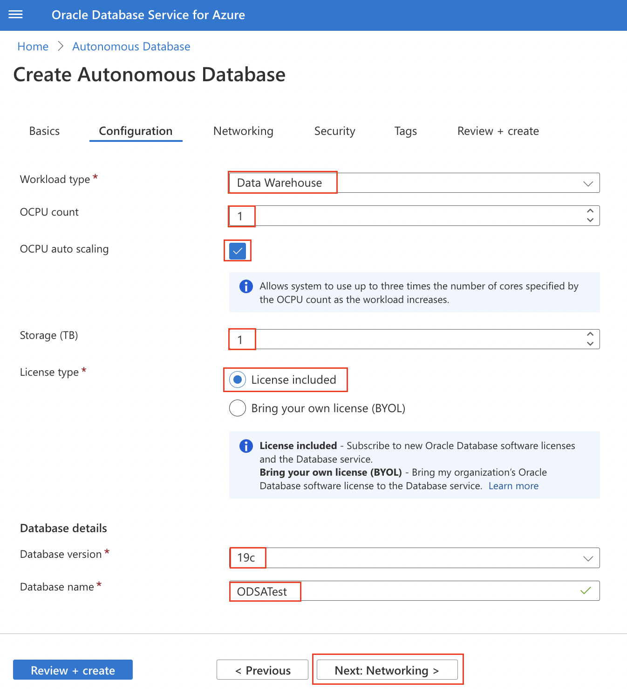

6. We will provide, the **Networking** information after click **Next: Security**.
    
    - **Access type**: **Secure access from everywhere**
    - **Require mutual TLS (mTLS) authentication**: Off

    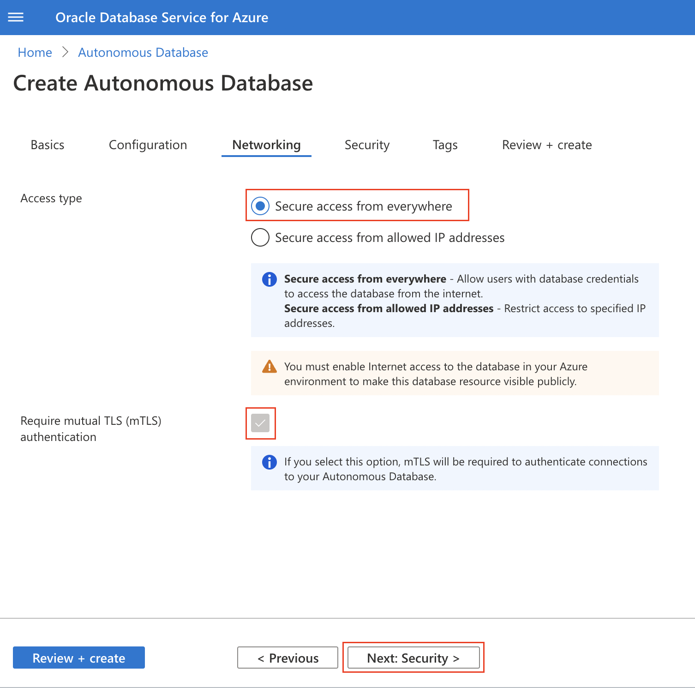

7. We will provide, the **Security** information after click **Next: Tags**.
    
    - **Database administrator credentials**: **ADMIN**
    - **Password**: Remember Password must contain at least 2 uppercase, 2 lowercase, 2 special, and 2 numeric characters. The special characters must be _, #, or -. The value must be between 12 and 30 characters long.
    - **Confirm password**: Remember Password must contain at least 2 uppercase, 2 lowercase, 2 special, and 2 numeric characters. The special characters must be _, #, or -. The value must be between 12 and 30 characters long.

    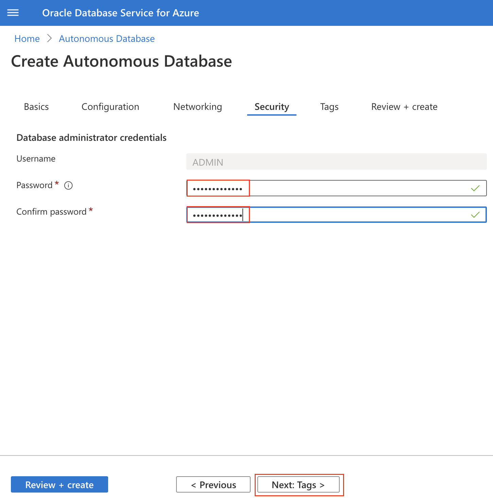

8. We will provide, the **Tags** information after click **Next: Review + create**. You can include any tags associated to name and value in this section. We will leave it blank for the workshop purpose but feel free to add any if you wish.
    
    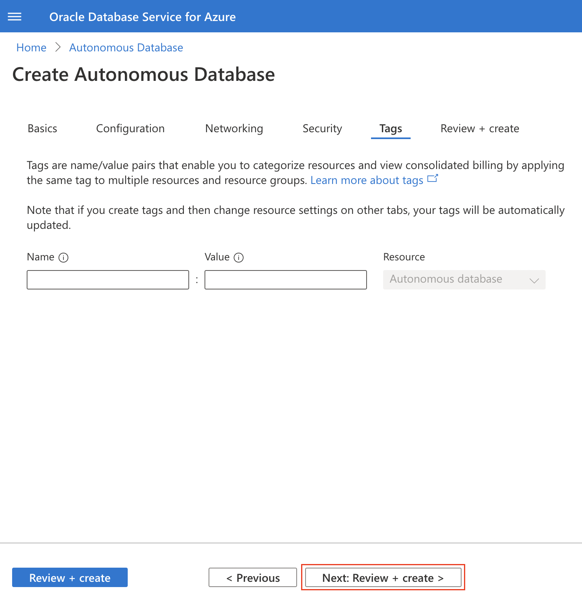

9. We will review the information that we provide and click **Create**.
    
    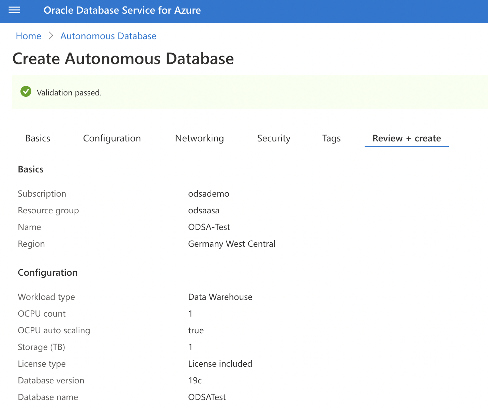
    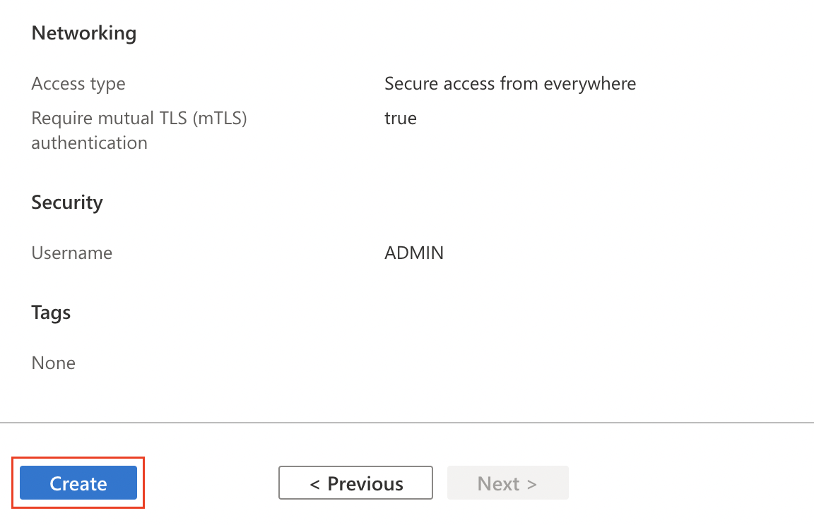

10. Your **Autonomous Warehouse Database** has been created. **Congrats!** Be sure you have selected the location where you created the database. In out case **Germany West Central**.

    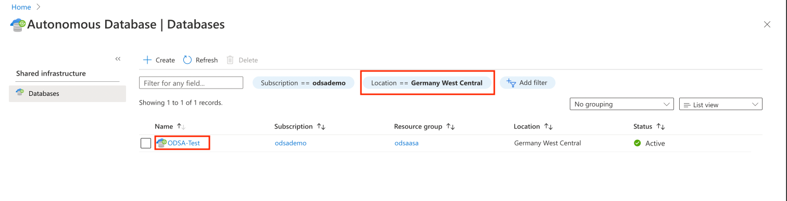

*You can proceed to the next lab…*

## Acknowledgements
* **Author** - Priscila Iruela, Technology Product Strategy Director
* **Contributors** - Victor Martin Alvarez, Technology Product Strategy Director
* **Last Updated By/Date** - Priscila Iruela, September 2022

## Need Help?
Please submit feedback or ask for help using our [LiveLabs Support Forum](https://community.oracle.com/tech/developers/categories/livelabsdiscussions). Please click the **Log In** button and login using your Oracle Account. Click the **Ask A Question** button to the left to start a *New Discussion* or *Ask a Question*.  Please include your workshop name and lab name.  You can also include screenshots and attach files.  Engage directly with the author of the workshop.

If you do not have an Oracle Account, click [here](https://profile.oracle.com/myprofile/account/create-account.jspx) to create one.