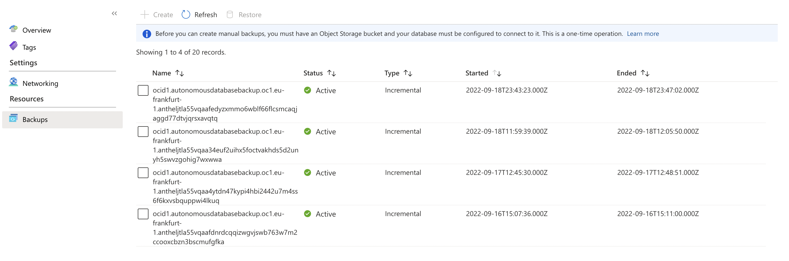
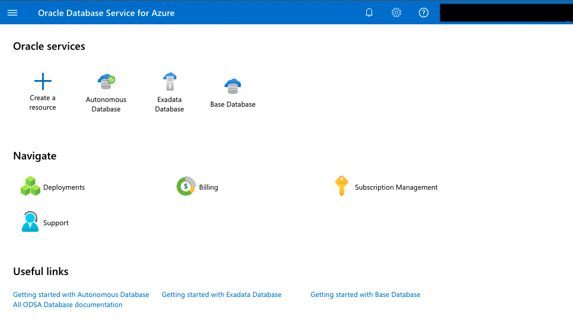
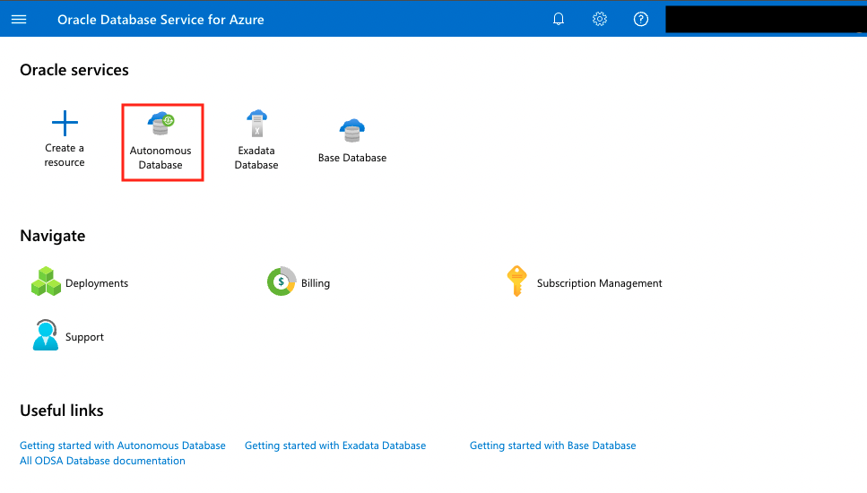
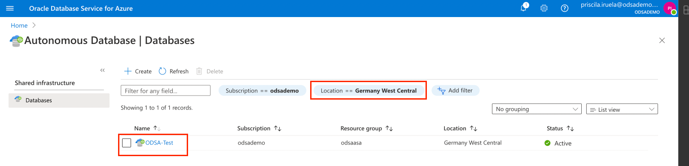
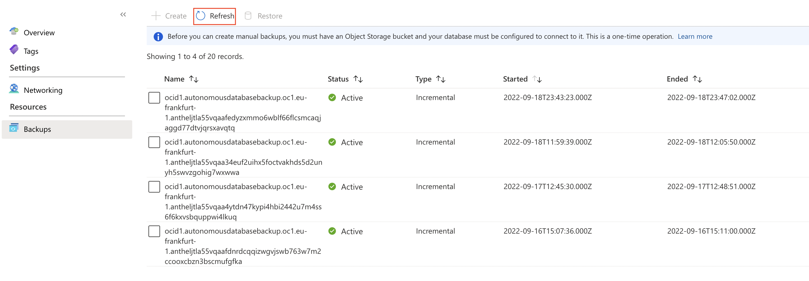
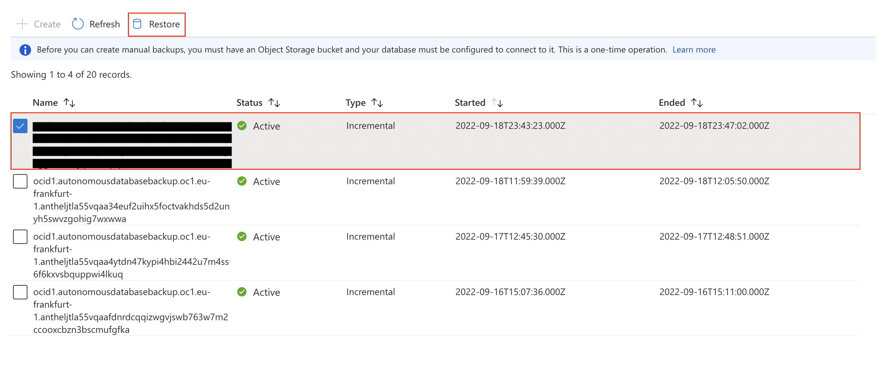
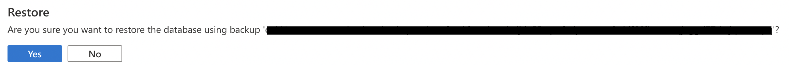
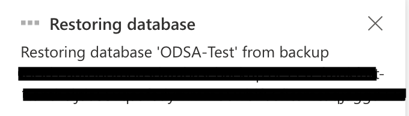

# Backups Dashboards

## Introduction

In this lab we will show the Backups dashboard.

**Estimated Lab Time: 5 minutes.**

### Objectives

In this lab, you will:

* Use every capability that Backups Dashboard has:

    - Create
    - Refresh
    - Restore

### Prerequisites

* Have previous labs completed.

## Task 1: Backups - Create

We will create a new backup for our **Oracle Autonomous Database Service for Azure**.

1. Login to **Azure ODSA Portal**: [signup.multicloud.oracle.com/azure](https://signup.multicloud.oracle.com/azure)

    

2. We can see on the ODSA Dashboard the three database versions that we can provision. Click on **Autonomous Database**.

    

3. **Select** the database that we created on the previous lab. Be sure you have selected the location where you created the database. In out case **Germany West Central**.

    

4. **Click** on the **Backups menu** in the left side of the window and you will access to Backups dashboard.

    

5. Before you can create manual backups, you must have an Object Storage bucket and your database must be configured to connect to it. This is a one-time operation. [Learn more here](https://docs.oracle.com/en-us/iaas/Content/Database/Tasks/adbbackingup.htm#creatingbucket).

## Task 2:  Backups - Refresh

1. **Click** on **Refresh** button to access to this dashboard.

    

2. Your **Backups will be refreshed** all changes that you have done recently. 

## Task 3: Backups - Restore

1. **Select** one of the automatic backups that we have created automatically for you. After click **Restore**.

    

2. You can access to the **Restore dashboard** where you can **restore** the **Backup** confirming that you want to restore that particular backup.

    

3. After a few seconds, your **Backup will be restored**.

    

*You can proceed to the next lab…*

## Acknowledgements
* **Author** - Priscila Iruela, Technology Product Strategy Director
* **Contributors** - Victor Martin Alvarez, Technology Product Strategy Director
* **Last Updated By/Date** - Priscila Iruela, September 2022

## Need Help?
Please submit feedback or ask for help using our [LiveLabs Support Forum](https://community.oracle.com/tech/developers/categories/livelabsdiscussions). Please click the **Log In** button and login using your Oracle Account. Click the **Ask A Question** button to the left to start a *New Discussion* or *Ask a Question*.  Please include your workshop name and lab name.  You can also include screenshots and attach files.  Engage directly with the author of the workshop.

If you do not have an Oracle Account, click [here](https://profile.oracle.com/myprofile/account/create-account.jspx) to create one.