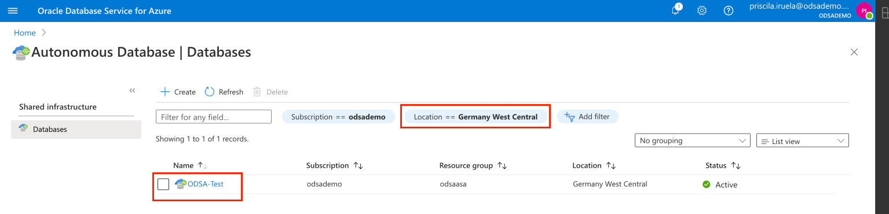

# Oracle Database Actions

## Introduction

In this lab we will use and have a quick tour of **Oracle Database Actions**. 
**Oracle Database Actions** is a web-based interface that uses Oracle REST Data Services to provide development, data tools, administration and monitoring features for Oracle Autonomous Database.

The main features include executing your SQL statements and scripts, creating Data Modeler diagrams, developing RESTful web services, managing JSON collections, and using the Data Load, Catalog, Data Insights, Business Models, and Data Transforms tools to load data from local and remote sources, view data in your tables and views, view objects in your data dictionary, and organize, analyze, and transform your data.

If you want to lear more about Oracle Database Action click [here](https://docs.oracle.com/en/database/oracle/sql-developer-web/sdwad/about-sdw.html#GUID-AF7601F9-7713-4ECC-8EC9-FB0296002C69).

**Estimated Lab Time: 15 minutes.**

### Objectives

In this lab, you will:

* Use Oracle Database Actions on the Azure Portal

### Prerequisites

* Have previous labs completed.

## Task 1: Oracle Database Actions

1. Login to Azure ODSA Portal: [signup.multicloud.oracle.com/azure](https://signup.multicloud.oracle.com/azure)

    

*You can proceed to the next lab…*

## Acknowledgements
* **Author** - Priscila Iruela, Technology Product Strategy Director
* **Contributors** - Victor Martin Alvarez, Technology Product Strategy Director
* **Last Updated By/Date** - Priscila Iruela, August 2022

## Need Help?
Please submit feedback or ask for help using our [LiveLabs Support Forum](https://community.oracle.com/tech/developers/categories/livelabsdiscussions). Please click the **Log In** button and login using your Oracle Account. Click the **Ask A Question** button to the left to start a *New Discussion* or *Ask a Question*.  Please include your workshop name and lab name.  You can also include screenshots and attach files.  Engage directly with the author of the workshop.

If you do not have an Oracle Account, click [here](https://profile.oracle.com/myprofile/account/create-account.jspx) to create one.