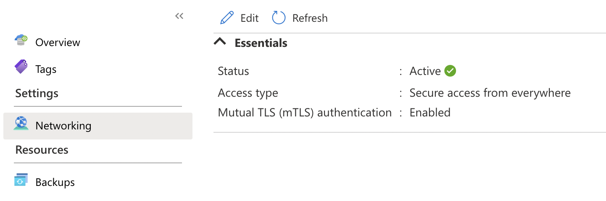
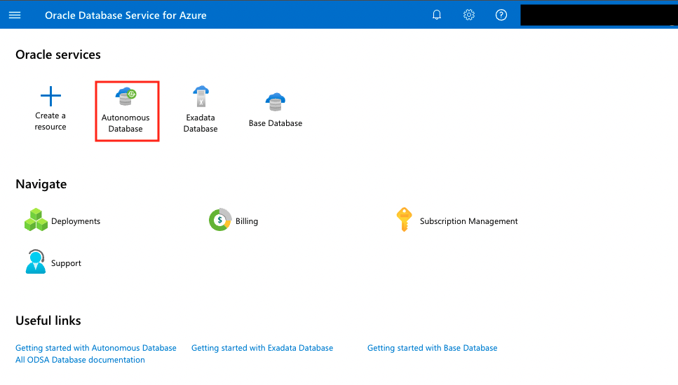
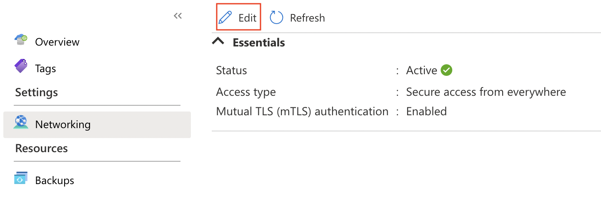
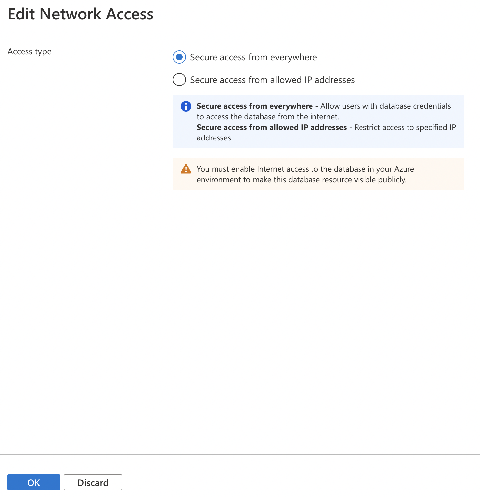
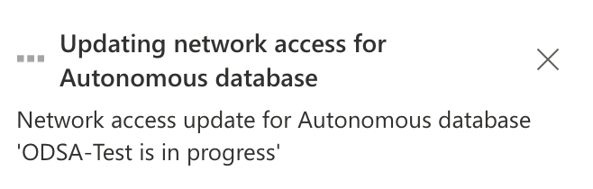
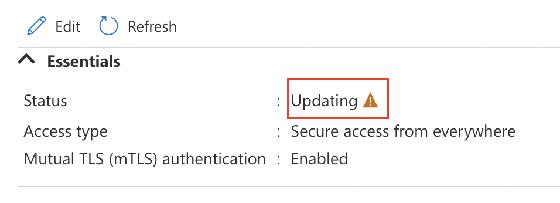
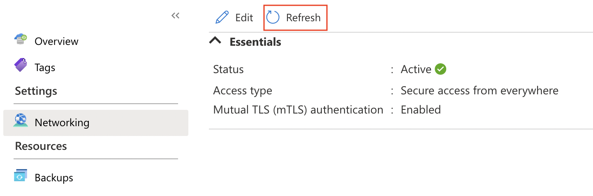

# Networking Dashboards

## Introduction

In this lab we will show the Networking dashboard.

**Estimated Lab Time: 5 minutes.**

### Objectives

In this lab, you will:

* Use every capability that Backups Dashboard has:

    - Edit
    - Refresh

### Prerequisites

* Have previous labs completed.

## Task 1: Networking - Edit

We will edit the networking configuration that we have in our **Oracle Autonomous Database Service for Azure**.

1. Login to **Azure ODSA Portal**: [signup.multicloud.oracle.com/azure](https://signup.multicloud.oracle.com/azure)

    

2. We can see on the ODSA Dashboard the three database versions that we can provision. Click on **Autonomous Database**.

    

3. **Select** the database that we created on the previous lab. Be sure you have selected the location where you created the database. In out case **Germany West Central**.

    

4. **Click** on the **Networking menu** in the left side of the window and you will access to Networking dashboard.

    

5. Click **Edit** button to access to this dashboard.

    

6. You can **Edit the Network Access** using the following options:
    - Secure access from everywhere  - Selected on the database creation.
    - Secure access from allowed IP addresses
    After you have eddited the access, click **OK** to applh the changes.

    

7. After a few seconds, your **Access type will be changed**.

    

8. The **Networking Database Status** will be **Updating** during a few seconds. After will changed again to **Active**.

    

## Task 2: Networking - Refresh

1. **Click** on **Refresh** button to access to this dashboard.

    

2. Your **Networking status will be refreshed** all changes that you have done recently. 

*You can proceed to the next lab…*

## Acknowledgements
* **Author** - Priscila Iruela, Technology Product Strategy Director
* **Contributors** - Victor Martin Alvarez, Technology Product Strategy Director
* **Last Updated By/Date** - Priscila Iruela, September 2022

## Need Help?
Please submit feedback or ask for help using our [LiveLabs Support Forum](https://community.oracle.com/tech/developers/categories/livelabsdiscussions). Please click the **Log In** button and login using your Oracle Account. Click the **Ask A Question** button to the left to start a *New Discussion* or *Ask a Question*.  Please include your workshop name and lab name.  You can also include screenshots and attach files.  Engage directly with the author of the workshop.

If you do not have an Oracle Account, click [here](https://profile.oracle.com/myprofile/account/create-account.jspx) to create one.