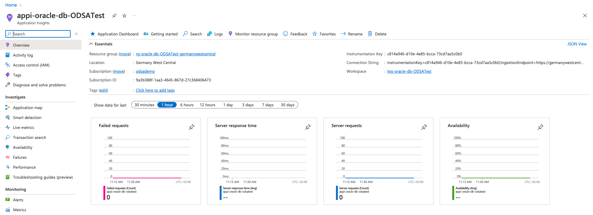
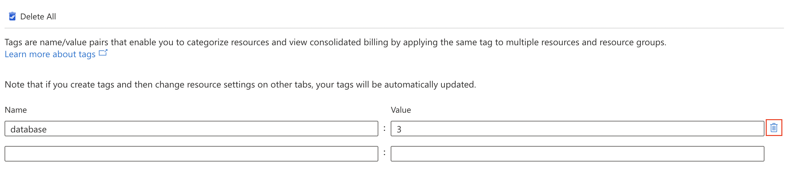

# Overview and Tags Dashboards

## Introduction

In this lab we will learn the different capabilities that **Oracle Database Service for Azure** portal has under **Overview** and **Tags** sections.

**Estimated Lab Time: 15 minutes.**

### Objectives

In this lab, you will:

* Use every capability that Overview Dashboard has:

    - Database Actions
    - Metrics
    - Scale
    - Start
    - Stop
    - Restart
    - Download wallet
    - Rotate wallet
    - Refresh
    - Change password
    - Delete

* Use Tags capability from Tags Dashboard

### Prerequisites

* Have previous labs completed.

## Task 1: Overview - Database Actions

**Oracle Database Actions** is a web-based interface that uses Oracle REST Data Services to provide development, data tools, administration and monitoring features for Oracle Autonomous Database.

The main features include executing your SQL statements and scripts, creating Data Modeler diagrams, developing RESTful web services, managing JSON collections, and using the Data Load, Catalog, Data Insights, Business Models, and Data Transforms tools to load data from local and remote sources, view data in your tables and views, view objects in your data dictionary, and organize, analyze, and transform your data.

If you want to lear more about Oracle Database Action click [here](https://docs.oracle.com/en/database/oracle/sql-developer-web/sdwad/about-sdw.html#GUID-AF7601F9-7713-4ECC-8EC9-FB0296002C69).

1. Login to **Azure ODSA Portal**: [signup.multicloud.oracle.com/azure](https://signup.multicloud.oracle.com/azure)

    

2. We can see on the ODSA Dashboard the three database versions that we can provision. Click on **Autonomous Database**.

    

3. **Select** the database that we created on the previous lab. Be sure you have selected the location where you created the database. In out case **Germany West Central**.

    

4. **Click** on the **Database Actions** button to access to this dashboard.

    

5. **Sign in** using the user **ADMIN** and the **password** that we created on the previous lab.

    

6. You can access to the **Database Actions dashboard** where you can use **Development, Data Tools, Administration, Monitoring, Downloads and Related Services** capabilities. Spend a bit of time using and learning them.

    
    

## Task 2: Overview - Metrics

1. **Click** on **Metrics** button to access to this dashboard.

    

2. You can access to the **Application Insights dashboard** where you can use **Application Dashboard, Getting started, Search, Logs, Monitor resource group, Feedback, Favorites, Rename and Delete** under the Overview seection. Spend a bit of time using and learning them.

    

## Task 3: Overview - Scale

1. **Click** on **Scale** button to access to this dashboard.

    

2. You can access to the **Scale dashboard** where you can use scale the **OCPU count** and **Storage (TB)** based on your business needs. Spend a bit of time using and learning them.

    

## Task 4: Overview - Start

1. **Click** on **Start** button to access to this dashboard.

    

2. You can't access to the **Start dashboard** as the database is **Active** at the moment. As soon as you stop it, this button will be accesible to Start the database.

## Task 5: Overview - Stop

1. **Click** on **Stop** button to access to this dashboard.

    

2. You can access to the **Stop dashboard** where you can **stop** the **Database** confirming that you want to stop the Autonomous Database.

    

## Task 6: Overview - Restart

1. **Click** on **Restart** button to access to this dashboard.

    

2. You can access to the **Restart dashboard** where you can **restart** the **Database** confirming that you want to restart the Autonomous Database.

    

## Task 7: Overview - Download wallet

1. **Click** on **Download wallet** button to access to this dashboard.

    

2. **Write the Password** that we created on previous lab to download the wallet and click **OK**.

    

3. After a few seconds, your **wallet will be downloaded**.

    

## Task 8: Overview - Rotate wallet

1. **Click** on **Rotate Wallet** button to access to this dashboard.

    

2. You can access to the **Rotate wallet dashboard** where you can **confirm** that the wallet will be rotate and the implications.

    

3. After a few seconds, your **wallet will be rotated**.

    

## Task 9: Overview - Refresh

1. **Click** on **Refresh** button to access to this dashboard.

    

2. Your **database will be refreshed** all changes that you have done recently. 

## Task 10: Overview - Change password

1. **Click** on **Change password** button to access to this dashboard.

    

2. **Write the New admin password** and click **OK**.

    

3. After a few seconds, your **password will be changed**.

    

## Task 11: Overview - Delete

1. **Click** on **Delete** button to access to this dashboard.

    

2. You can access to the **Delete dashboard** where you can **delete** the **Database** confirming that you want to delete the Autonomous Database.

    

## Task 12: Tags

We will explore now the **Tags dashboard**, where we can create tags to getr notifications related to every resource that we want to tag. [If you want to learn more about tags](https://docs.oracle.com/en-us/iaas/Content/Tagging/Concepts/taggingoverview.htm).

1. **Click** on the **Tags menu** in the left side of the window and you will access to Tags dashboard.
    
    

2. **Write** any tag that you want to include and the value. In my case, I will create a tag for **3 databases** as an example. After **Apply** the changes.

    

3. After a few seconds, your **tag will be created**.

    

4. You can **removed** any tags at any time, just clicking the **Delete** button next to each tag.

    

*You can proceed to the next lab…*

## Acknowledgements
* **Author** - Priscila Iruela, Technology Product Strategy Director
* **Contributors** - Victor Martin Alvarez, Technology Product Strategy Director
* **Last Updated By/Date** - Priscila Iruela, September 2022

## Need Help?
Please submit feedback or ask for help using our [LiveLabs Support Forum](https://community.oracle.com/tech/developers/categories/livelabsdiscussions). Please click the **Log In** button and login using your Oracle Account. Click the **Ask A Question** button to the left to start a *New Discussion* or *Ask a Question*.  Please include your workshop name and lab name.  You can also include screenshots and attach files.  Engage directly with the author of the workshop.

If you do not have an Oracle Account, click [here](https://profile.oracle.com/myprofile/account/create-account.jspx) to create one.